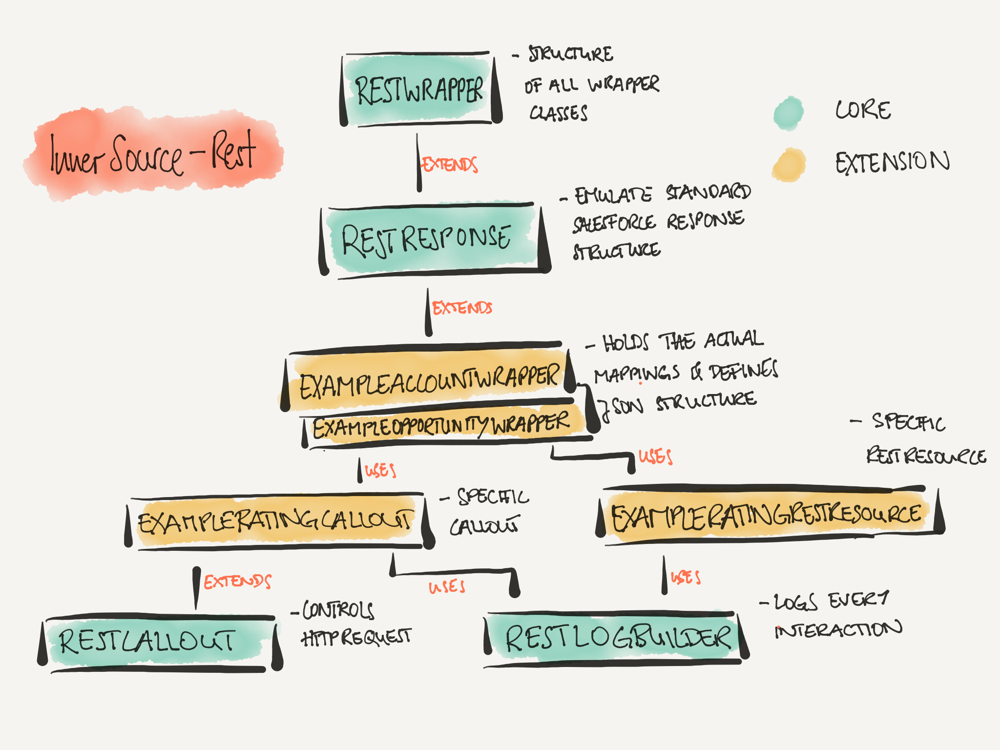

# InnerSource-Rest
InnerSource-Rest is a starter kit to for REST/JSON integrations on the Force.com platform. Its goal is to create easily readable and maintainable incoming and outgoing REST integrations.

## Getting started
To get up and running with the code clone the repository and use your IDE or ANT Migration Tool to deploy OR: <a href="https://githubsfdeploy.herokuapp.com?owner=mavens&repo=InnerSource-Rest">
  
</a>

## The Core


Each Wrapper class should extend the RestWrapperMVN class to inherit its structure and functionality. Only if the wrapper is used in a response message it should instead extend the RestResponseMVN class.

The RestLogBuilderMVN class ensures that all interactions can be logged in the same way.

RestCalloutMVN should be extended when creating a callout.

## The Example
### JSON

**POST callout and GET RestResource**
```
{
	"success": true,
	"opportunities": [{
		"opportunityStage": "Prospecting",
		"opportunityName": "Pyramid Emergency Generators",
		"opportunityId": "0060Y000003gYTcQAM",
		"opportunityAmount": 100000
	}],
	"isBigPlayer": true,
	"accountType": "Customer - Channel",
	"accountName": "Pyramid Construction Inc.",
	"accountId": "0010Y00000D9sydQAB"
}
```

**POST Callout response and PUT RestResource**

```
{
	"accountRating": "Super duper high",
	"accountId": "0010Y00000D9sydQAB"
}
```

### Wrapper
Let's look at the ExampleAccountWrapperMVN, ExampleAccountWrapperTestMVN, ExampleOpportunityWrapperMVN and ExampleOpportunityWrapperTestMVN classes.

Each wrapper class has its own mapping and conversion methods which control the mappings between sObjects and wrapper. If we can, we should keep this one to one BUT we can use helper wrapper classes to do a two to one ratio (i.e. map an Account and its primary Contact into one wrapper class)

We need these wrapper classes to define the JSON structure and use the JSON magic Force.com provides us with.

### Callout
Let's look at the ExampleRatingCalloutMVN and ExampleCalloutTestMVN classes.

There are a couple of things happening in here. The actual method which does the POST and updates the account with the returned rating. It handles all the parsing via the wrapper classes and controls the logger.

Then we have three 'invoking methods'.
One for being invoked via BATCH, one @future and one enabling the callout to be invoked by a process.

For each callout we can create a new class and re-use the RestCalloutMVN class from the core. If there are items like a certificate that are the same for all callouts, we can update those inside the RestCalloutMVN class and the createHttpRequest method.

### RestResource
Let's look at the ExampleRatingRestResourceMVN and ExampleRatingRestResourceTestMVN classes.

Relatively straight forward we have one method per action (POST, PUT, GET), it controls the logging and DML logic and makes full use of Wrapper/JSON magic.

## Contributing
Please feel free to create code changes and pull requests that can be discussed by the team if you see anything that can be improved!
